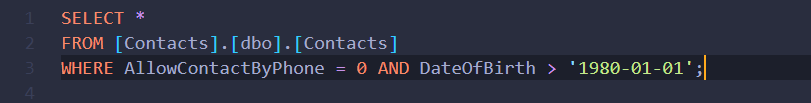
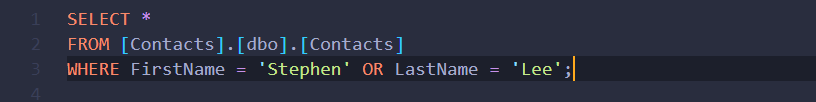
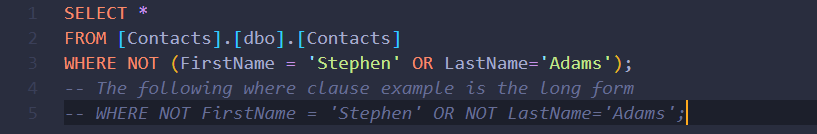
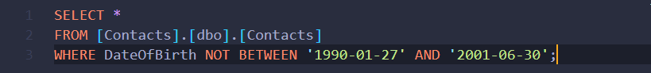
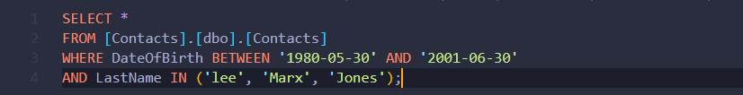
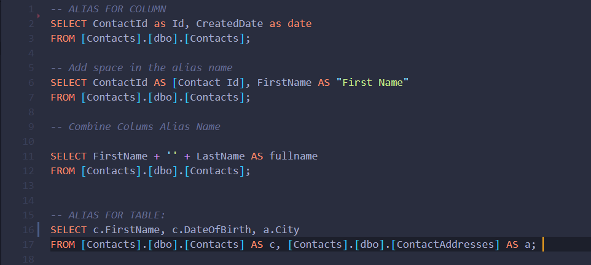

# SQL - Relational Database
## Environments:
- Need to up and running the [SQL Server](https://www.microsoft.com/en-us/sql-server/sql-server-downloads).
- To interact with the database download [SQL Server Management Studio](https://docs.microsoft.com/en-us/sql/ssms/download-sql-server-management-studio-ssms?view=sql-server-ver15)

## Abbreviation:
- SQL: Structured Query Language
- RDBMS: Relational Database Management System.
- ANSI: American National Standards Institute
- IOS: International Organization for Standardization

## SQL Clause:
- The SELECT clause is used to select data from a database
- The WHERE clause is used to filter records
- The ORDER BY keyword is used to sort the result-set in ascending (ASC) or descending (DESC) order.
- The INSERT INTO clause is used to insert new records.

## What is database [normalization](https://towardsdatascience.com/database-normalization-explained-53e60a494495)
- Normalization is a technique for organizing data in a database

## What are the basic SQL commands?
- Select: Retrieves one or more rows form the table.
- Insert Into: Adds one or more rows into a table.
- Update: Modifies one or more rows in a table.
- Delete: Removes one or more rows from one table.

## Constraints: 
    - Constraints specify the rules of the data in a table.
    - Constraints ensures the accuracy and reliability of the data in the table.
    - Constraints can be apply in the column level or table level.

## What are the Constraints?
- [x] NOT NULL - Ensures that a column cannot have a NULL value.
- [x] UNIQUE - Ensures that all values in a column are different
- [x] PRIMARY KEY 
    - Uniquely identifies each row in a table. 
    - Primary keys must contain UNIQUE values, and cannot contain NULL values.
    - A table can have only one primary key; and in the table, the primary key can consist of single or multiple columns.
    ```sql
        CREATE TABLE users (
	       id SERIAL PRIMARY KEY,
            username VARCHAR(50) 
        )
    ```
- [x] FOREIGN KEY 
    - A FOREIGN KEY is a key used to link between two tables together.
    - A FOREIGN KEY is a field in one table that refers to the PRIMARY KEY in another table.
    ```sql
        CREATE TABLE photos(
            id SERIAL PRIMARY KEY,
            url VARCHAR(200),
            user_id INTEGER REFERENCES users(id)
        );
    ```
- [x] CHECK - Ensures that all values in a column satisfies a specific condition
- [x] DEFAULT - Sets a default value for a column when no value is specified
- [x] INDEX 
    - Index used to create indexes in the tables.
    - Indexes are used to retrieve data from the database very quickly.

## What is auto increment?
- Auto-increment allows a unique number to be generated automatically when a new record is inserted into a table

## What is LIKE Operator? 
- The LIKE operator is use with WHERE clause to search for a specified pattern.

## There are two wildcards that conjunction with the LIKE operator
- [x] % The percent sign represents zero, one, or multiple characters.
- [x] _ The underscore represents a single character

## LIKE Operators with ```%``` and ```_``` wildcards
**LIKE Operators**          | **Description**
--------------------------- | --------------------------
```LIKE 'a%'```             |  Finds any values that start with "a"
```LIKE '%a'```             |  Finds any values that end with "a"
```LIKE '%rip%'```          |  Finds any values that have "rip" in any position
```LIKE 'a%o'```            |  Finds any values that start with "a" and ends with "o"
```LIKE '_r%'```            |  Finds any values that have "r" in the second position
```LIKE 'a__%'```           |  Finds any values that start with "a" and at least 3 characters in length

## What is [WHERE](./sql-commands/where.sql) Clause? 
- The WHERE clause is used to filter records.
- The WHERE clause is extract only those records that fulfill the specified condition.
- The WHERE clause can be combined with AND, OR, and NOT operators to perform multiple conditions.

## Operators that are use in The WHERE Clause
**Operator**     | **Description**
-----------------| ------------------ 
```=```	         |  Equal
```>```          |  Greater than
```<```          |  Less than
```>=```         |  Greater then or equal  
```<=```         |  Less then or equal 
```<>```         |  Not Equal
```Between```    |  Between 
```Like```       |  Like
```in```         |  In 

# WHERE clause with different operators 
### AND operator: The AND operator displays a record if all the conditions are TRUE.


### OR operator: The OR operator displays a record if one of the condition is TRUE.


### NOT operator: The NOT operator displays a record if the condition(s) is NOT TRUE


### BETWEEN operator: The BETWEEN operator selects values within a given range. The values can be numbers, text and dates.


### NOT BETWEEN operator: To SELECT outside the of the range we can use not between operator.


### BETWEEN with IN operator: The IN operator allows to specify multiple values in the WHERE clause, and is a shorthand for multiple OR conditions.

 
## LIKE

## SQL [Keyword Reference](https://www.w3schools.com/sql/sql_ref_keywords.asp)
- [ADD](): 
    - Adds a column in an existing table.
- [DISTINCT](): 
    - The DISTINCT keyword is used to return only distinct (different) values. It removes duplicate values.
- [AS](./sql-commands/alias.sql): 
    - AS Keyword is used for an alias. it is giving a temporary name in a table or a column.
    

## SQL has Four types Relationships 
- Many to One 
- One to Many
- Many to Many
- One to One
